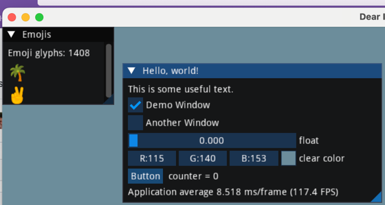
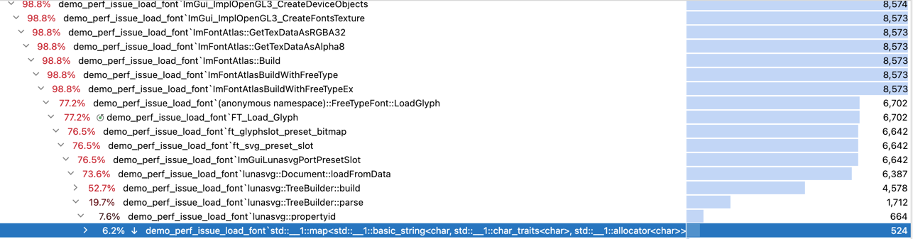
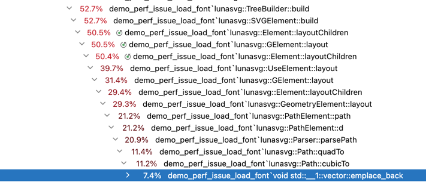

# Repro of a performance issue with Lunasvg when used inside ImGui as a font loader utility

### Intro
This repository will build a simple ImGui application that uses LunaSvg to load a font.

With LunaSvg, we can load "noto-untouchedsvg.ttf", and "TwitterColorEmoji-SVGinOT.ttf" with very good performance.

However, with "NotoColorEmoji-Regular.ttf", the performance takes a hit: it takes about 3 seconds per glyph.

### Code details
[demo_perf_issue_load_font.cpp](demo_perf_issue_load_font.cpp) is an adapted copy of external/imgui/examples/example_glfw_opengl3/main.cpp

The fonts are loaded here: note that the fonts are not loaded by the call to AddFontFromFileTTF, but by a later call to `ImFontAtlasBuildWithFreeType()`, 
and this is where the performance issue is.

```cpp

void DemoPerfIssueLoadFont()
{
    static ImWchar ranges[] = { 0x1, 0x1FFFF, 0 };
    static ImFontConfig cfg;
    cfg.OversampleH = cfg.OversampleV = 1;
    cfg.FontBuilderFlags |= ImGuiFreeTypeBuilderFlags_LoadColor;

    // Load a default font for ImGui: this does not use lunasvg, and it is fast
    std::string fontDefault = ThisDir() + "/fonts/DroidSans.ttf";
    ImGui::GetIO().Fonts->AddFontFromFileTTF(fontDefault.c_str(), 16.0f, &cfg, ranges);

    // Load emoji fonts
    {
        // will not use lunasvg. Fast
        std::string fontFile = ThisDir() + "/fonts/NotoEmoji-Regular.ttf";
        gEmojiFont = ImGui::GetIO().Fonts->AddFontFromFileTTF(fontFile.c_str(), 30.0f, &cfg, ranges);
    }
    {
        // will load 1408 colored glyphs, with lunasvg. Fast!
        std::string fontFile = ThisDir() + "/fonts/noto-untouchedsvg.ttf";
        gEmojiFont  = ImGui::GetIO().Fonts->AddFontFromFileTTF(fontFile.c_str(), 30.0f, &cfg, ranges);
    }
    {
        // will load 1428 glyphs, with lunasvg. Slow. About 2 seconds per glyph
        std::string fontFile = ThisDir() + "/fonts/NotoColorEmoji-Regular.ttf";
        gEmojiFont  = ImGui::GetIO().Fonts->AddFontFromFileTTF(fontFile.c_str(), 30.0f, &cfg, ranges);
    }
}

```

### Build instructions

```bash
git clone git@github.com:pthom/lunasvg_perf_issue.git
cd lunasvg_perf_issue
git submodule update --init
mkdir build
cd build
cmake ..
make
./demo_perf_issue_load_font
```

At this step, it should display run fast, and display glyphs from "noto-untouchedsvg.ttf";


Now, uncomment this in [demo_perf_issue_load_font.cpp](demo_perf_issue_load_font.cpp), line 76:

```cpp
    {
        // will load 1428 glyphs, with lunasvg. Slow, very slow. About 2 seconds per glyph!
        std::string fontFile = ThisDir() + "/fonts/NotoColorEmoji-Regular.ttf";
        gEmojiFont  = ImGui::GetIO().Fonts->AddFontFromFileTTF(fontFile.c_str(), 30.0f, &cfg, ranges);
    }
```

And the performance drop will be visible.


### Analysis of the performance issue:

A quick analysis with a profiler shows that time seems to be spent in std::map::find + std::vector::emplace_back 




